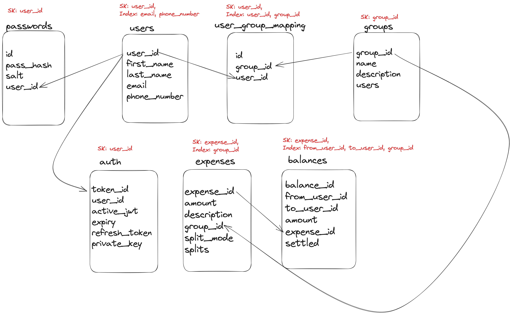

# splitwise

## Requirements
Create a backend application that allows users to do the following tasks
1. Create a user account/log in
2. Search for other users in the database
3. Add an expense with one or more users where
   1. they can choose who paid
   2. who owes how much in
      1. percentages
      2. absolute amounts
   3. they can exclude a particular user from the expense altogether
4. Create an expense group of users

## Future scope
1. Add reminders
2. Integrate with collect flows for P2P (Gpay, PayTM)
3. Add update history in expenses API
4. Simplify payments in a group

## APIs
```
POST /users/
Request Body:
{
    "email": "harshad@example.com",
    "phoneNumber": "9923124184",
    "firstName": "Harshad",
    "lastName": "Manglani",
    "passwordHash": "hash"
}

Response:
Code 201 Created
Body:
{
    "userId": "U1234"
}

POST /users/login
Request Body:
{
    "email": "harshad@example.com",
    "phoneNumber": "9923125184", // either email or phoneNumber
    "passwordHash": "hash"
}

Response:
Code 200 OK
Body:
{
    "userId": "U1234"
    "token": "token",
    "expiry": 1201212121,
    "refreshToken": "refreshToken"
}

GET /users/{userId}
Request Headers:
Authorization: Bearer <JWT>
Response:
Code 200 OK
Body:
{
    "userId": "U123",
    "totalBalance": -1000.34,
    "groups": []
}

GET /users/search?searchTerms=Harshad&Manglani
Request Headers:
Authorization: Bearer <JWT>
Response:
Code 200 OK
Body:
{
    "results": [
        {
            "userId": "U1234",
            "firstName": "Harshad",
            "lastName": "Manglani"
        }
    ]
}

POST /groups
Request Headers:
Authorization: Bearer <JWT>
Request Body:
{
   "userId": "U1234,
   "name": "Coorg",
   "description": "May Trip 2023",
   "users": ["U1234", "U4567", "U3456", "U4568"]
}

Response:
Code 201 Created
Body:
{
   "groupId": "G123",
   "createdAt": 121291212,
   "updatedAt": 121291212
}


POST /expenses
Request Headers:
Authorization: Bearer <JWT>
Request Body:
{
    "userId": "U1234",
    "groupId": "G123", // null is the default group
    "amount": 100.34,
    "splitMode": "EQUAL", // PERCENTAGE, AMOUNT,
    "paidBy": "U1234",
    "splits": [
        {
            "userId": "U1234",
            "value": 55 // based on enum value of splitMode
        }
        {
            "userId": "U2345",
            "value": 22
        }
        {
            "userId": "U3456",
            "value": 13
        }
        {
            "userId": "U4567",
            "value": 10.34
        }
    ],
}

Response:
Code 201 Created
Body:
{
    "expenseId": "EX1234",
    "groupId": "G123",
    "balances": [
        {
            "balanceId": "B123",
            "fromUserId": "U2345",
            "toUserId": "U1234",
            "amount": 22,
            "settled": false
        },
        {
            "balanceId": "B234",
            "fromUserId": "U3456",
            "toUserId": "U1234",
            "amount": 13,
            "settled": false
        },
        {
            "balanceId": "B2345",
            "fromUserId": "U4567",
            "toUserId": "U1234",
            "amount": 10.34,
            "settled": false
        }
    ],
    "createdAt": 121291212,
    "updatedAt": 121291212
}

PATCH /expenses/{expenseId}
Request Headers:
Authorization: Bearer <JWT>
Request Body:
{
    "userId": "U2345",
    "amount": 100.34,
    "splitMode": "EQUAL", // PERCENTAGE, AMOUNT
    "splits": [
        {
            "userId": "U1234",
            "value": 55 // based on enum value of splitMode
        }
        {
            "userId": "U2345",
            "value": 22
        }
    ],
}

Response:
Code: 200 OK
Body:
{
    "expenseId": "EX1234",
    "groupId": "G123",
    "balances": [
        {
            "balanceId": "B123",
            "fromUserId": "U2345",
            "toUserId": "U1234",
            "amount": 22,
            "settled": false
        },
        {
            "balanceId": "B234",
            "fromUserId": "U3456",
            "toUserId": "U1234",
            "amount": 13,
            "settled": false
        },
        {
            "balanceId": "B2345",
            "fromUserId": "U4567",
            "toUserId": "U1234",
            "amount": 10.34,
            "settled": false
        }
    ],
    "createdAt": 121291212,
    "updatedAt": 121291212
}

GET /expenses/{expenseId}
Request Headers:
Authorization: Bearer <JWT>

Response:
Code: 200 OK
Body:
{
    "expenseId": "EX1234",
    "amount": 100.34,
    "balances": [
        {
            "balanceId": "B123",
            "fromUserId": "U2345",
            "toUserId": "U1234",
            "amount": 22,
            "settled": false
        },
        {
            "balanceId": "B234",
            "fromUserId": "U3456",
            "toUserId": "U1234",
            "amount": 13,
            "settled": false
        },
        {
            "balanceId": "B2345",
            "fromUserId": "U4567",
            "toUserId": "U1234",
            "amount": 10.34,
            "settled": false
        }
    ],
    "createdAt": 121291212,
    "updatedAt": 121291212
}

PATCH /balances/{balanceId}
Request Headers:
Authorization: Bearer <JWT>
Request Body:
{
   "userId": "U123",
   "balanceId": "B123",
   "settled": true
}

Response:
Code: 200 OK
```
## Database schema

All tables will have created_at, updated_at by default.



## Goals
1. Learn about annotations and how they work
2. Learn about thread utilisation, CPU utilisation and multi threading
3. Learn about async and sync processes
4. Implement the visitor pattern
5. Understand garbage collection

### Open Points
1. How do I implement user authentication with JWTs in the header and annotations?
2. 